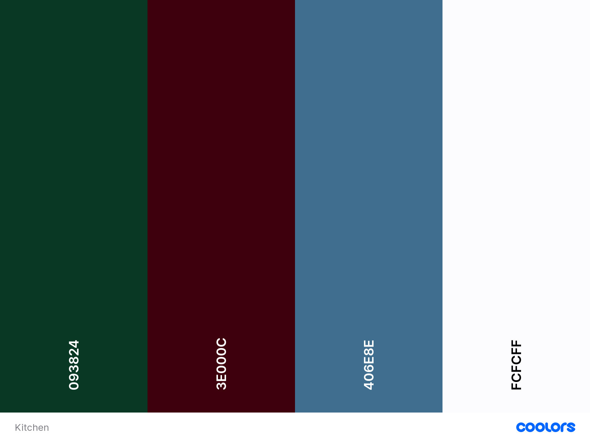
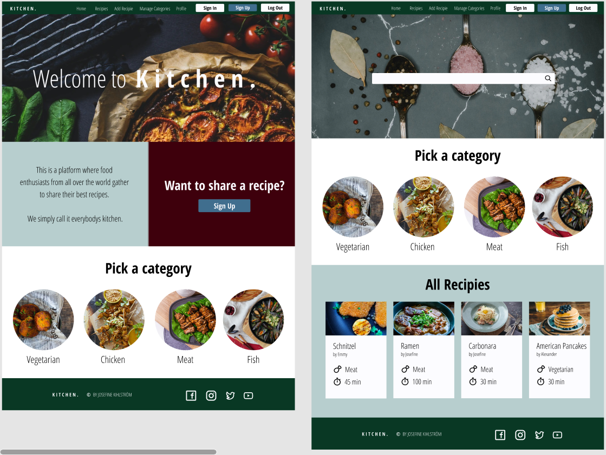
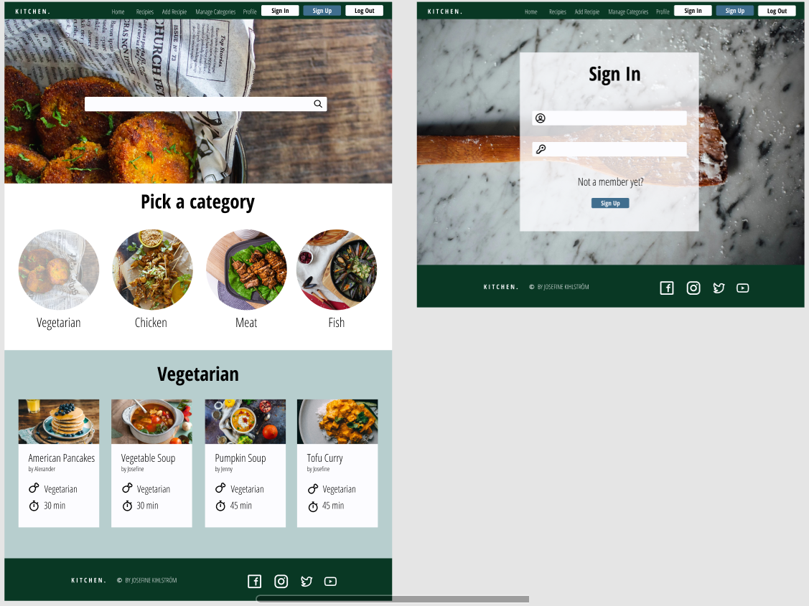
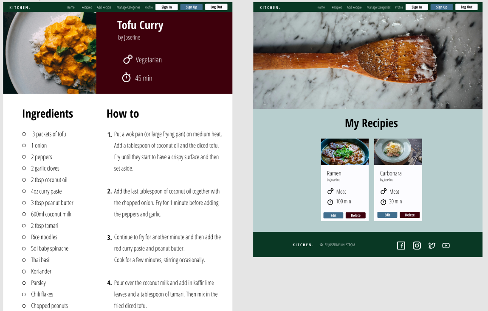
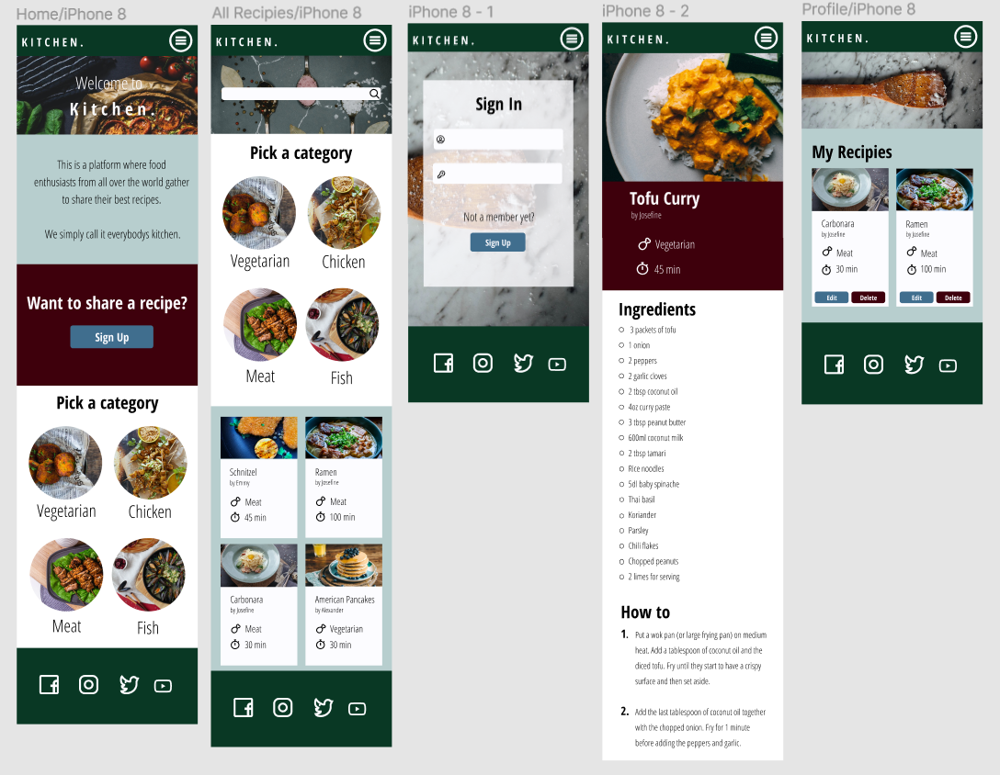
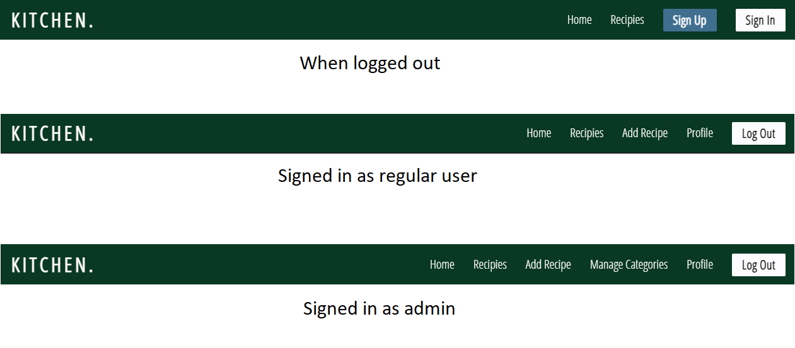
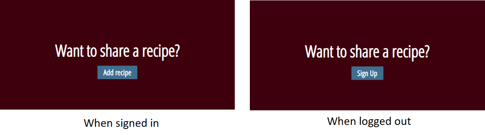
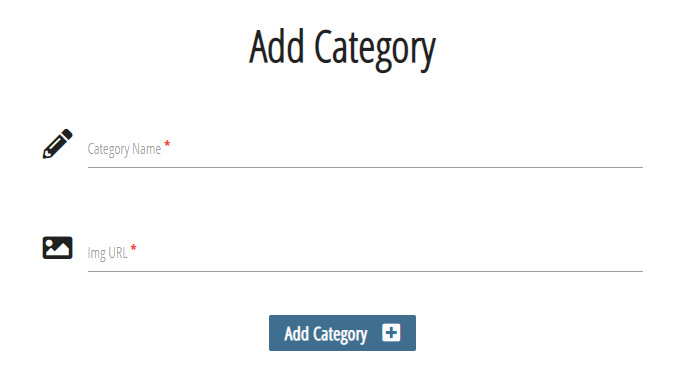

# Kitchen
## Content
1. [About](#about)
2. [UX](#ux)
    - [UX goals](#ux-goals)
    - [User stories](#user-stories)
    - [Design process](#design-process)
    - [Wireframes](#wireframes)
3. [Features](#features)
    - [Features left to implement](#features-left-to-implement)
4. [Technologies Used](#technologies-used)
    - [Languages](#languages)
    - [Libraries](#libraries)
    - [Other](#other)
5. [Testing](#testing)
6. [Deployment](#deployment)
7. [Cloning This Project](#cloning-this-project)
8. [Credits](#credits)
    - [Media](#media)
    - [Recipe images](#recipe-images)
    - [Recipe text](#recipe-text)
9. [Acknowledgements](#acknowledgements)
    - [Pages used to find information](#pages-used-to-find-information)
    - [Code](#code)
    - [Thank you](#thank-you)
10. [Disclaimer](#disclaimer)

## About
Kitchen is a website where food enthusiasts from all over the world can gather to share their best recipes.
With the simple functions, it is easy for everyone to create an account to get started sharing their best 
cooking tricks, and in the future we hope to be able to offer more functions to make the stay on the website 
even easier.
If you're not interested in signing up and share a recipe, you can ofcourse visit the site to brows through all
the fantastic recipies for some cooking inspiration.

[View the live website here!](https://kitchen-josefinekihlstrom.herokuapp.com/get_home)

## UX
### UX goals
The UX goals for this website are the following:
- Simple design with a fixed navigation bar at the top.
- Clear sections of the content of each page.
- The site is responsive to all devices.
- All text on the site is easy to read without any distacting backgrounds.


### User Stories
The user stories was defined during the **Strategy Plane** phase of this project.
As a user I want to:
- Get inspired into learning new recipes.
- Browse different categories for easier navigation of what kind of recipe I want to cook.
- Be able to sign up and share my own recipies.
- Have a good overlook of my own recipies that I've made.
- Be able to edit and delete recipies that I have made.

### Design process
The **structure** of the site is based upon the data that is presented on the page. I wanted the first page to be simple
and clear for the visitor which then by deciding what content they want to visit navigates through the navigation
bar at the top to get to that specific content.

This recipe site has four collections in the MongoDB database where the main content presented on the paige is 
stored.

- Recipies
- Categories
- Preptime
- Users

The color scheme for this project was generated with the technology of [Coolors](https://coolors.co/). I wanted the
colors to be a little bit darker and warmer to welcome the visitor, but still make the content of the pages
easy to understand with the light foregrounds and the pop of color on the buttons on the page.
<br>
<br>
The font used for this project was [Open Sans Condensed](https://fonts.google.com/specimen/Open+Sans+Condensed?query=open+sans+) 
and came from [Google Fonts](https://fonts.google.com/).

<div align="center">
    
</div>

### Wireframes
The **skeleton** and **surface** plane was defined in the structure of the wireframes for this project.
The wireframes where made with the technology of Figma and can be viewed 
[here](https://www.figma.com/file/aCMvZLULq29HaO6xSANTzr/MS3?node-id=273669%3A448).

<div align="center">
    
    <br>
    Home and Recipies pages.
</div>
<br>
<br>
<div align="center">
    
    <br>
    Inside Category and Sign Up pages.
</div>
<br>
<br>
<div align="center">
    
    <br>
    Inside Recipe and Profile pages.
</div>
<br>
<br>
<div align="center">
    
    <br>
    Wireframes for mobile devices.
</div>
<br>
<br>

## Features
The features of the site was defined during the **scope plane** stage and all but one features from the original idea
was applied to this project.

The features of this web site are:

### All Pages:
- Fixed Navigation bar at the top of all pages. Complete list of links in the navbar:
    - **Logo** - Linked to home page.
    - **Home** - Linked to home page.
    - **Recipies** - linked to recipe page.
    - **Add Recipe** - Linked to page where the user can add recipe.
    - **Manage Categories** - Linked to a page where admin can manage categories.
    - **Profile** - Linked to the profile page of the user.
    - **Sign In** - Linked to page where user can sign in.
    - **Sign Up** - Linked to page where new user can sign up.
    - **Log Out** - Logges user out of the site.

- Footer with copyright text and social links.

<div align="center">
    
    <br>
    The Navbar with the different links depending on if you are logged in or not, an admin or not.
</div>
    
### Home Page:
- Hero image with a welcome text.
- A blue section with brief information about the page.
- A red box with a heading text that encourages the visitor to add a recipe and button 
(depending on if the user is logged in or not)
- A section with recipe categories that includes:
    - Image of the category.
    - Name of the category

<div align="center">
    
    <br>
    The red info box that shows different button text depending on if user is logged in or not.    
</div>

### Recipies Page:
- Hero image.
- A section with recipe categories that includes:
    - Image of the category.
    - Name of the category
- Section with all recipies including:
    - Image of the recipe.
    - Name of the recipe.
    - Name of the user who added the recipe.
    - Category of the recipe.
    - Preptime of the recipe.
    - Link to the recipe page.
- The maker of the recipe also have two buttons above the recipe link:
    - Delete button - Makes it possible to delete the recipe.
    - Edit button - Makes it possible to edit the recipe.

### Selected Recipe Page:
- An image of the selected recipe.
- A red section with information about the recipe, including:
    - Name of the recipe.
    - Name of the user who added the recipe.
    - Category of the recipe.
    - Preptime of the recipe.
- A section divided into two columns that includes:
    - The ingredients list to the left.
    - The preparation steps to the right.

IMAGE OF SELECTED RECIPE PAGE HERE

### Add Recipe Page:
- A form for the logged in user to add their recipe to. The form includes:
    - An input field to write the name of the recipe.
    - An option list to pick the category of the recipe.
    - An option list to pick the total preptime for the recipe.
    - A textarea to add all the ingredients of the recipe.
    - A textarea to add the preparation steps of the recipe.
    - An input field to add a image url for the recipe image that is to be used.
    - A button to submit the recipe.

### Manage Categories Page:
This page can only be viewed by the admin user.
- A button that leads to a form to add a new category to the page.
- A section with the existing recipe categories that includes:
    - Image of the category.
    - Name of the category
    - Delete button, that deletes the category.
    - Edit button, that makes it possible to edit the image url or the name of the category.

<div align="center">
    
    <br>
    The form that makes it possible for the admin user to add a new category.
</div>

### Profile Page:
The link to the profile page can be reached in the navbar once a user is signed in to the page. The features of the
profile page are:
- Hero image.
- Section with all recipies the user has made including:
    - Image of the recipe.
    - Name of the recipe.
    - Name of the user who added the recipe.
    - Category of the recipe.
    - Preptime of the recipe.
    - Delete button - Makes it possible to delete the recipe.
    - Edit button - Makes it possible to edit the recipe.
    - Link to the recipe page.


### Features left to implement
- Some type of timer function that automatically logges the user out after a certain time of no activity.
- A search function to make the user able to search for specific recipies or ingredients in a recipe. This feature
was something I wanted to make in this project, and I started to build the function but encountered bugs during the
process. This led me to take the decision to remove this feature due to lack of time of fixing the bug that was
ciritcal for the websites overall functionality.
- A rating function to make all visitors able to rate each recipe. The rating result would then be displaying in the
recipe cards on the recipe page together with all other information.
- When the user choose a category to go to, I would like for that category to become disabled to click on again 
when the user is already on that specific categories page. 
This to add more clarity to the user on what category that is currently viewed.
- Currently when someone is on the 'All Recipies' page, there is no limit on how many recipies that are showing on
the page. A feature left to implement here would be to only show for example 12 recipies at a time and then the visitor
gets to press a 'next' button to view the next 12 recipies.

## Technologies used
### Languages
- **HTML 5** - Used to create the structure of the site.
- **CSS3** - Used to style the HTML elements.
- **Python** - Used for back end programming.
- [Jinja]() - Used for template inheritance and database linking.

### Libraries
- [JQuery]() - Used to write the JavaScript code.
- [MongoDB]() - Database that was used for this project.
- [Flask]() - Used to write python code.
- [Materialize]() - Used for the overall design of the page.

### Other
- [Fontawesome]() - Used for icons.
- [Coolors](https://coolors.co/) - Used to generate the color scheme.
- [Figma]() - Used to make wireframes.
- [Google Fonts]() - The font used for this project: **Open Sans Condensed*

## Testing
To View the full testing, [click here!](testing.md)

## Cloning this project
If you want to work further on my project, go ahead and clone it following these steps:

1. Go to the top of the [Josefinekihlstrom/Kitchen](https://github.com/Josefinekihlstrom/Kitchen) repository.
2. Click the button named 'Code' next to the green 'Gitpod' button.
3. Choose HTTPS and copy the URL by clicking the icon next to the URL.
4. Open Git Bash/Terminal and change the current working directory to the location where you want the cloned directory.
5. Type 'git clone' and then paste the copied URL.
6. Press 'Enter'.
7. Make sure to create a database for this project with MongoDb and install the requirements using the following
command: ``` pip3 install -r requirements.txt ```
8. Create an **env.py** file and a **.gitignore** file and insert the following to them:
    - env.py:
    ```
    import os

    os.environ.setdefault("IP", "0.0.0.0")
    os.environ.setdefault("PORT", "5000")
    os.environ.setdefault("SECRET_KEY", "< your_secret_key_for_this_project >")
    os.environ.setdefault("MONGO_URI", "mongodb+srv://<username>:<password>@<clustername>.gjwpx.mongodb.net/<database_name>?retryWrites=true&w=majority")
    os.environ.setdefault("MONGO_DBNAME", "< database_name >")
    ```

    - .gitignore:
    ```
    env.py
    ```
9. To run this cloned version of the project type in the following in the terminal:
``` python3 app.py ```

To get to the source of this information: [Click here!](https://docs.github.com/en/free-pro-team@latest/github/creating-cloning-and-archiving-repositories/cloning-a-repository)

## Deployment
This project was deployed to Heroku. To deploy it to Heroku I did the following:

1. After creating a Heroku account I created a new app and selected the region closest to me. 

2. After the app was created I went to 'Settings' and clicked on the 'Reveal Config Vars' button in the 'Config 
Vars' section.

3. From there I added the values to the following Config Vars:
    - MONGO_URI : ``` mongodb+srv://<username>:<password>@<clustername>.gjwpx.mongodb.net/<database_name>?retryWrites=true&w=majority ```
    - PORT : ``` 5000 ```
    - IP : ``` 0.0.0.0 ```

    (< username >, < password >, < clustername > and < database_name > in the MONGO_URI where replaced with my 
    database values)

4. Then I had to add a **requirements.txt** file and **Procfile** with the following two commands in the terminal:
    - ``` pip3 freeze --local > requirements.txt ```
    - ``` echo web: python app.py > Procfile ```

5. To link my Heroku app with the repository I logged in to my Heroku, navigated to my app and clicked on the 
'Deploy' button in the menu.

6. In the 'Deployment method' section I clicked on the GitHub icon to first connect to my GitHub account and then
search for the repository name for this project. Once the repository was found I clicked on the 'Connect' button
to connect to the app.

## Credits
### Media
- Index hero image by [LUM3N](https://unsplash.com/photos/Ngy0B2YWalk)
- Sign Up/Log In image by [CHUTTERSNAP](https://unsplash.com/photos/R9DeG1PnE9U)
- Vegetarian category image [Louis Hansel](https://images.unsplash.com/photo-1559847844-b0915a3800c6?ixid=MXwxMjA3fDB8MHxwaG90by1wYWdlfHx8fGVufDB8fHw%3D&ixlib=rb-1.2.1&auto=format&fit=crop&w=942&q=80)
- Chicken category image [The Fry Family Food Co.](https://images.unsplash.com/photo-1584949602334-4e99f98286a9?ixid=MXwxMjA3fDB8MHxwaG90by1wYWdlfHx8fGVufDB8fHw%3D&ixlib=rb-1.2.1&auto=format&fit=crop&w=634&q=80)
- Meat category image [Sam Loyd](https://images.unsplash.com/photo-1595777216528-071e0127ccbf?ixid=MXwxMjA3fDB8MHxwaG90by1wYWdlfHx8fGVufDB8fHw%3D&ixlib=rb-1.2.1&auto=format&fit=crop&w=1050&q=80)
- Fish category image [Victoria Shes](https://images.unsplash.com/photo-1594804233323-786d5c2ed9fb?ixid=MXwxMjA3fDB8MHxwaG90by1wYWdlfHx8fGVufDB8fHw%3D&ixlib=rb-1.2.1&auto=format&fit=crop&w=634&q=80)
- Recipies hero image [Anastasia Zhenina](https://images.unsplash.com/photo-1605709303005-0fdddfd73dc4?ixid=MXwxMjA3fDB8MHxwaG90by1wYWdlfHx8fGVufDB8fHw%3D&ixlib=rb-1.2.1&auto=format&fit=crop&w=967&q=80)

### Recipe images
- Mushroom recipe image [Karolina Kołodziejczak](https://images.unsplash.com/photo-1607116667981-ff148a14e975?ixid=MXwxMjA3fDB8MHxwaG90by1wYWdlfHx8fGVufDB8fHw%3D&ixlib=rb-1.2.1&auto=format&fit=crop&w=634&q=80)
- Grilled Cheese Sandwich [Pixzolo Photography](https://images.unsplash.com/photo-1528736235302-52922df5c122?ixid=MXwxMjA3fDB8MHxwaG90by1wYWdlfHx8fGVufDB8fHw%3D&ixlib=rb-1.2.1&auto=format&fit=crop&w=2022&q=80)
- Chicken Paillard [Tareq Taylor](https://www.koket.se/kyckling-paillard)
- Butter-fried pikeperch [Tina Nordström](https://www.koket.se/smorstekt-gosfile-med-lattstuvad-blomkal-dill-och-ansjovis)
- Chicken Noodle Sallad [Lotta Lundgren](https://www.koket.se/nudelsallad-med-friterad-kyckling)
- Pasta with Pasta with anchovies [Isabella Morrone](https://www.koket.se/pasta-med-sardeller-och-broccoli)
- Spaghetti Pancetta [Kungsörnen](https://www.koket.se/spaghetti-med-pancetta-och-purjo)
- Beef Stroganoff [Tommy Myllymäki](https://www.koket.se/mitt-kok/tommy-myllymaki/biff-stroganoff/)
- Cowboy Soup [Linda Skugge](https://www.koket.se/efter-tio/linda-skugge/cowboysoppa-med-kottfars/)
- Chicken Gratin [Tareq Taylor](https://www.koket.se/kramig-italiensk-gratang)
- Sausage Stroganoff [Sara Begner](https://www.koket.se/sara_begner/soppor_och_grytor/korv_och_chark/korv_stroganoff/)
- Chicken with lemongrass [Donal Skehan](https://www.koket.se/mitt-kok/donal-skehan/kyckling-med-citrongras-och-chili/)
- Flying haloumi [Siri Barje](https://www.koket.se/flygande-halloumi)
- Janssons Frestelse [Per Morberg](https://www.koket.se/morberg-lagar-husmanskost/per-morberg/janssons-frestelse-pa-per-morbergs-vis/)
- Soy marinated salmon [Tommy Myllymäki](https://www.koket.se/mitt-kok/tommy-myllymaki/sojamarinerad-lax-med-sesambroccoli/)

### Recipe text
Recipies not mentioned here are made up by me.
- American Pancakes by [Delphine Fortine](https://www.delscookingtwist.com/easy-fluffy-american-pancakes/)
- Grilled Cheese Sandwich [Sal](https://www.allrecipes.com/recipe/23891/grilled-cheese-sandwich/)
- Chicken Paillard [Köket.se](https://www.koket.se/kyckling-paillard)
- Butter-fried pikeperch [Köket.se](https://www.koket.se/smorstekt-gosfile-med-lattstuvad-blomkal-dill-och-ansjovis)
- Chicken Noodle Sallad [Köket.se](https://www.koket.se/nudelsallad-med-friterad-kyckling)
- Pasta with Pasta with anchovies [Köket.se](https://www.koket.se/pasta-med-sardeller-och-broccoli)
- Spaghetti Pancetta [Köket.se](https://www.koket.se/spaghetti-med-pancetta-och-purjo)
- Beef Stroganoff [Köket.se](https://www.koket.se/mitt-kok/tommy-myllymaki/biff-stroganoff/)
- Cowboy Soup [Köket.se](https://www.koket.se/efter-tio/linda-skugge/cowboysoppa-med-kottfars/)
- Chicken Gratin [Köket.se](https://www.koket.se/kramig-italiensk-gratang)
- Sausage Stroganoff [Köket.se](https://www.koket.se/sara_begner/soppor_och_grytor/korv_och_chark/korv_stroganoff/)
- Chicken with lemongrass [Köket.se](https://www.koket.se/mitt-kok/donal-skehan/kyckling-med-citrongras-och-chili/)
- Flying haloumi [Köket.se](https://www.koket.se/flygande-halloumi)
- Janssons Frestelse [Köket.se](https://www.koket.se/morberg-lagar-husmanskost/per-morberg/janssons-frestelse-pa-per-morbergs-vis/)
- Soy marinated salmon [Köket.se](https://www.koket.se/mitt-kok/tommy-myllymaki/sojamarinerad-lax-med-sesambroccoli/)

## Acknowledgements
### Pages used to find information
- [W3C Schools](https://www.w3schools.com/)
- [Stack Overflow](https://stackoverflow.com/)
- [Youtube](https://www.youtube.com/)

### Code
- This project was made with guidance from Mini Project | Putting It All Together led by Tim
- [Flask error page](https://flask.palletsprojects.com/en/1.1.x/patterns/errorpages/)

### Thank you

## Disclaimer
This website was created for educational use only.

