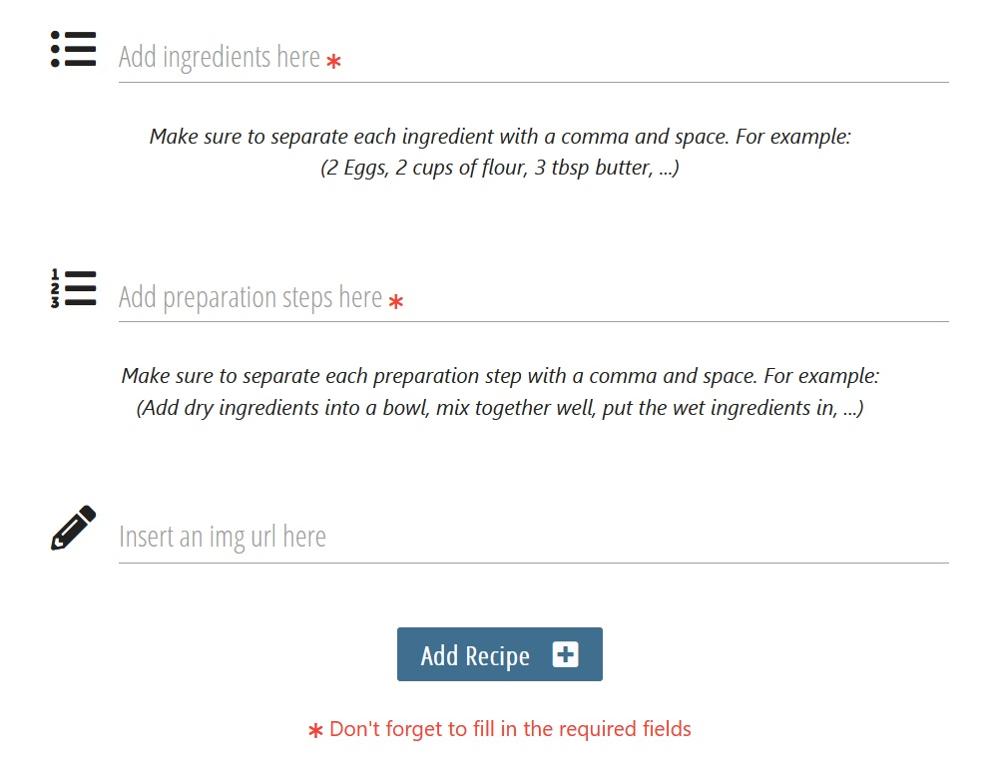

# Testing

## Content

## User Testing
1. **Get inspired into learning new recipes.**
    - This page was designed with an idea to look as realistic as possible (from a beginners point of view). 
    This to both encourage and inspire the user to scroll through all different kinds of recipies.
    - High quality images are used throughout the site to increase the user experience to the max.

2. **Browse different categories for easier navigation of what kind of recipe I want to cook.**
    - The different categories are displayed on the following pages for easy access for the user:
        - Home Page 
        - Recipies Page
    - The categories has their own category image that represents the content behind the category itself. 
    This to make it easy to identify the category before reading the name of it.
    - When clicking on each category the category image acts as the hero image, to also indicate which category is
    currently viewed.

3. **Be able to sign up and share my own recipies.**
    - When the user first visits the page he/she is prompted to press the blue button in the red section right under the hero image
    to sign up to the page.
    - The user can also sign up by pressing the 'Sign Up' button in the navigation bar at the top.
    - The appearance of the 'Sign Up' button is consistent throughout the site, with its blue color and white text.
    - When the user is signed in, the button text in the red section changes to 'Add Recipe' to encourage the user
    to share a recipe.
    - The user can also click on the link in the navigation bar with the text 'Add Recipe' to get to the page to add
    a recipe.

4. **Have a good overlook of my own recipies that I've made.**
    - On the users profile page, all the users recipies are listed right under the hero image of the page.
    - When the user don't have any recipies made the recipies section will fill out with a blue color to indicate
    that the list is empty.

5. **Be able to edit and delete recipies that I have made.**
    - On the each user recipe card there are two buttons displayed that only the logged in user can se:
        - A red 'Delete' button. 
        - A blue 'Edit' button.
    - The user can edit and delete their recipies on the following pages:
        - Profile Page:
            - On the profile page, the user has a better access over the recipies he/she has written. From here the
            user is able to both delete and edit each recipe.
        - Recipies Page:
            - The user is also able to delete and edit their recipies from the Recipies Page, however when a lot of
            recipies are displaying, and not only by the user in session, the user has to scroll through all of them
            in the order that the recipe was made and without any type of relevance.

## Automated Testing

## Manual Testing
All manual tests were done in the following browsers:
- Firefox
- Google Chrome
- Microsoft Edge

### Home Page/Index Page
---
- Navbar:
    - Make sure navbar covers the width of the viewport.
    - Click on 'Kitchen.' icon on the left to see that it links to the home page.
    - Click on the 'Home' link to see that it links to the home page.
    - Click on the 'Recipies' link to see that it links to the recipies page.
    - Click on the 'Sign Up' link to see that it links to the sign up page.
    - Click on the 'Sign In' link to see that it links to the sign in page.
    - **When Signed in as regular user:* Click on 'Add Recipe' link to see that it links to the add recipe page.
    - **When Signed in as regular user:* Click on 'Profile' link to see that it links to the profile page.
    - **When Signed in as regular user:* Click on 'Log Out' link to see that it removes the session user cookie
    and redirects the user to the 'Sign In' page.
    - **When Signed in as Admin user:* Click on 'Add Recipe' link to see that it links to the add recipe page.
    - **When Signed in as Admin user:* Click on 'Profile' link to see that it links to the profile page.
    - **When Signed in as Admin user:* Click on 'Manage Categories' link to see that it links to the manage 
    categories page.
    - **When Signed in as Admin user:* Click on 'Log Out' link to see that it removes the session user cookie
    and redirects the user to the 'Sign In' page.

- Main Content:
    - Make sure that the main content fits the entire viewport without any white gaps, including:
        - Hero image
        - blue and red boxes
        - 'Pick a category' section

    - Click on 'Sign Up' button in the red box to see that it links to the sign up page.
    - Make sure every category image is displaying.
    - Click on the 'Chicken' category image to see that it links to the chicken category page.
    - Click on the 'Fish' category image to see that it links to the fish category page.
    - Click on the 'Meat' category image to see that it links to the meat category page.
    - Click on the 'Vegetarian' category image to see that it links to the vegetarian category page.

- Footer:
    - Make sure footer is covering the width of the viewport.
    - Make sure copyright text is displaying
    - Click on 'Facebook' icon to see that it links to facebook.com
    - Click on 'Instagram' icon to see that it links to instagram.com
    - Click on 'Twitter' icon to see that it links to twitter.com
    - Click on 'Youtube' icon to see that it links to youtube.com

### Recipies Page
---
- Navbar:
    - Make sure navbar covers the width of the viewport.
    - Click on 'Kitchen.' icon on the left to see that it links to the home page.
    - Click on the 'Home' link to see that it links to the home page.
    - Click on the 'Recipies' link to see that it links to the recipies page.
    - Click on the 'Sign Up' link to see that it links to the sign up page.
    - Click on the 'Sign In' link to see that it links to the sign in page.
    - **When Signed in as regular user:* Click on 'Add Recipe' link to see that it links to the add recipe page.
    - **When Signed in as regular user:* Click on 'Profile' link to see that it links to the profile page.
    - **When Signed in as regular user:* Click on 'Log Out' link to see that it removes the session user cookie
    and redirects the user to the 'Sign In' page.
    - **When Signed in as Admin user:* Click on 'Add Recipe' link to see that it links to the add recipe page.
    - **When Signed in as Admin user:* Click on 'Profile' link to see that it links to the profile page.
    - **When Signed in as Admin user:* Click on 'Manage Categories' link to see that it links to the manage 
    categories page.
    - **When Signed in as Admin user:* Click on 'Log Out' link to see that it removes the session user cookie
    and redirects the user to the 'Sign In' page.
        
- Main Content:
    - Make sure that the main content fits the entire viewport without any white gaps, including:
        - Hero image.
        - 'Pick a category' section.
        - 'All Recipies' section.
    - Make sure the search function is working by typing in a test word of 'Pasta'.
        - If recipe: The 'All Recipies' section displays all recipies that include the word pasta in either the
        ingredient list or the preparation steps.
    - Make sure the search function is working when no recipe is found by typing in the word 'Nej'.
        - No recipe during the testing of this site includes the word no, 
        so therefore the 'All recipies' section displays a red text saying
        'No recipies found, try searching for something else'.
    - Click on 'Reset' button in the search section to see that it links back to all recipies displaying.
    - Click on the 'Chicken' category image to see that it links to the chicken category page.
    - Click on the 'Fish' category image to see that it links to the fish category page.
    - Click on the 'Meat' category image to see that it links to the meat category page.
    - Click on the 'Vegetarian' category image to see that it links to the vegetarian category page.
    - Make sure all recipies are showing when first visiting the page but also after clicking the 'Reset' button
    in the search function.
    - Make sure the following content is displaying in each recipe card:
        - Recipe image.
        - Name of recipe.
        - Category of the recipe.
        - The time to prepare the recipe.
        - Link to the recipe.
        - When image link is broken, a default image shows.
    - Click on recipe link to see that it links to the selected recipe page.

- Footer:
    - Make sure footer is covering the width of the viewport.
    - Make sure copyright text is displaying
    - Click on 'Facebook' icon to see that it links to facebook.com
    - Click on 'Instagram' icon to see that it links to instagram.com
    - Click on 'Twitter' icon to see that it links to twitter.com
    - Click on 'Youtube' icon to see that it links to youtube.com

### Selected Recipe Page
- Navbar:
    - Make sure navbar covers the width of the viewport.
    - Click on 'Kitchen.' icon on the left to see that it links to the home page.
    - Click on the 'Home' link to see that it links to the home page.
    - Click on the 'Recipies' link to see that it links to the recipies page.
    - Click on 'Add Recipe' link to see that it links to the add recipe page. (When logged in as regular user or admin)
    - Click on 'Profile' link to see that it links to the profile page. (When logged in as regular user or admin)
    - Click on 'Log Out' link to see that it removes the session user cookie
    and redirects the user to the 'Sign In' page. (When logged in as regular user or admin)
    - Click on 'Manage Categories' link to see that it links to the manage categories page. (When logged in as admin)
    - Click on the 'Sign Up' link to see that it links to the sign up page. (When not logged in)
    - Click on the 'Sign In' link to see that it links to the sign in page. (When not logged in)

- Main Content:
    - Make sure the recipe image is displayed to the left on the same row as the red section with all recipe description.
        - Make sure if recipe image link is broke, a default image will display.
    - Make sure the red section with recipe details are containing the following:
        - Name of the recipe.
        - Name of the user who added the recipe.
        - Recipe category.
        - Preparation time.
    - Make sure the ingredients section is displaying all ingredients in an unordered list beginning each item
    with a check icon.
    - Make sure the preparation section is displaying each preparation step in an ordered list, dividing each step
    with a horizontal rule.

- Footer:
    - Make sure footer is covering the width of the viewport.
    - Make sure copyright text is displaying
    - Click on 'Facebook' icon to see that it links to facebook.com
    - Click on 'Instagram' icon to see that it links to instagram.com
    - Click on 'Twitter' icon to see that it links to twitter.com
    - Click on 'Youtube' icon to see that it links to youtube.com

### Sign Up Page
---
- Navbar:
    - Make sure navbar covers the width of the viewport.
    - Click on 'Kitchen.' icon on the left to see that it links to the home page.
    - Click on the 'Home' link to see that it links to the home page.
    - Click on the 'Recipies' link to see that it links to the recipies page.
    - Click on the 'Sign Up' link to see that it links to the sign up page.
    - Click on the 'Sign In' link to see that it links to the sign in page.

- Main Content:
    - Make sure the background image covers the whole viewport without any white gaps.
    - Make sure the 'Sign Up' section is centered
    - Make sure the content inside the 'Sign Up' section is displaying and centered.
    - Click on the 'Username' input field to make sure the text you write diplays.
    - Click on the 'Password' input field to make sure the text you write diplays.
    - When writing less than 5 letters in the 'Username' input field the line under the input fields turns red.
    - When trying to write more than 15 letters in the 'Username' input field, the typing input stops.
    - When writing less than 5 letters in the 'Password' input field the line under the input fields turns red.
    - When trying to write more than 15 letters in the 'Password' input field, the typing input stops.
    - Click on the 'Sign Up' button when no input fields are typed in:
        - The page encourages the user to fill in the required fields.
    - Click on the 'Sign Up' button when username already exists:
    - The page displays a flash message that says 'Username already exists!'.
    - Click on the 'Sign Up' button when a new username and password is typed in:
        - Page signes user in and redirects user to the profile page.
    - Click on the 'Click here to sign in!' text to see that it links to the sign in page.        

- Footer:
    - Make sure footer is covering the width of the viewport.
    - Make sure copyright text is displaying
    - Click on 'Facebook' icon to see that it links to facebook.com
    - Click on 'Instagram' icon to see that it links to instagram.com
    - Click on 'Twitter' icon to see that it links to twitter.com
    - Click on 'Youtube' icon to see that it links to youtube.com

### Sign In Page
---
- Navbar:
    - Make sure navbar covers the width of the viewport.
    - Click on 'Kitchen.' icon on the left to see that it links to the home page.
    - Click on the 'Home' link to see that it links to the home page.
    - Click on the 'Recipies' link to see that it links to the recipies page.
    - Click on the 'Sign Up' link to see that it links to the sign up page.
    - Click on the 'Sign In' link to see that it links to the sign in page.

- Main Content:
    - Make sure the background image covers the whole viewport without any white gaps.
    - Make sure the 'Sign In' section is centered
    - Make sure the content inside the 'Sign In' section is displaying and centered.
    - Click on the 'Username' input field to make sure the text you write diplays.
    - Click on the 'Password' input field to make sure the text you write diplays.
    - When writing less than 5 letters in the 'Username' input field the line under the input fields turns red.
    - When trying to write more than 15 letters in the 'Username' input field, the typing input stops.
    - When writing less than 5 letters in the 'Password' input field the line under the input fields turns red.
    - When trying to write more than 15 letters in the 'Password' input field, the typing input stops.
    - Click on the 'Sign In' button when no input fields are typed in:
        - The page encourages the user to fill in the required fields.
    - Click on the 'Sign In' button when wrong username:
    - The page displays a flash message that says 'The username doesn't exist! Please try again'.
    - Click on the 'Sign In' button when correct username but wrong password is typed in:
        - The page displays a flash message that says 'The Username and/or Password is incorrect!'.
    - Click on the 'Sign In' button when correct username and password:
        - A flash message displays on the page saying 'Hi there, < username >' and redirects the user to the profile page.
    - Click on the 'Click here to sign up!' text to see that it links to the sign up page.

- Footer:
    - Make sure footer is covering the width of the viewport.
    - Make sure copyright text is displaying
    - Click on 'Facebook' icon to see that it links to facebook.com
    - Click on 'Instagram' icon to see that it links to instagram.com
    - Click on 'Twitter' icon to see that it links to twitter.com
    - Click on 'Youtube' icon to see that it links to youtube.com

### Add Recipe Page (regular user and admin user)
---
- Navbar:
    - Make sure navbar covers the width of the viewport.
    - Click on 'Kitchen.' icon on the left to see that it links to the home page.
    - Click on the 'Home' link to see that it links to the home page.
    - Click on the 'Recipies' link to see that it links to the recipies page.
    - Click on 'Add Recipe' link to see that it links to the add recipe page.
    - Click on 'Profile' link to see that it links to the profile page.
    - Click on 'Log Out' link to see that it removes the session user cookie
    and redirects the user to the 'Sign In' page.
    - **When Signed in as Admin user:* Click on 'Manage Categories' link to see that it links to the manage 
    categories page.

- Main Content:
    - Make sure 'Add Recipe' section is centered on the page.
    - Make sure all content inside the 'Add Recipe' is displaying.
    - 'Recipe Name' input:
        - Make sure icon is displaying.
        - Make sure input gets marked in red when filled out with less than 4 letters.
        - Make sure input stops typing when trying to write more than 25 letters.
    - 'Category' options:
        - Make sure icon is displaying.
        - Click on 'Choose category' and Make sure all categories are displaying in the option list.
        - **Bug noted when not choosing an option in the list. Please se 'Bugs Found' section further down.*
    - 'Preptime' options:
        - Make sure icon is displaying.
        - Click on 'How long will it take' and Make sure all preparation times are displaying in the option list.
        - **Bug noted when not choosing an option in the list. Please se 'Bugs Found' section further down.*
    - Ingredients textarea:
        - Make sure icon is displaying.
        - Make sure browser points out if the textarea input is not filled out when submitting the recipe.
        **Bug noted of colored line not working correctly. Please se 'Bugs Found' section further down.*
    - Preparation steps textarea:
        - Make sure icon is displaying.
        - Make sure browser points out if the textarea input is not filled out when submitting the recipe.
        **Bug noted of colored line not working correctly. Please se 'Bugs Found' section further down.*
    - Img URL input:
        - Make sure icon is displaying.
        - Make sure browser points out if field is not filled out when submitting the recipe.
    - 'Add Recipe' button:
        - Make sure that when form is filled out correctly and the 'Add Recipe' button is clicked the page redirects
        to the 'Recipies' page with all recipies displaying including the newely added one at the bottom.
    - Make sure red text about required fields are showing.
- Footer:
    - Make sure footer is covering the width of the viewport.
    - Make sure copyright text is displaying
    - Click on 'Facebook' icon to see that it links to facebook.com
    - Click on 'Instagram' icon to see that it links to instagram.com
    - Click on 'Twitter' icon to see that it links to twitter.com
    - Click on 'Youtube' icon to see that it links to youtube.com

### Profile Page (regular user and admin user)
---
- Navbar:
    - Make sure navbar covers the width of the viewport.
    - Click on 'Kitchen.' icon on the left to see that it links to the home page.
    - Click on the 'Home' link to see that it links to the home page.
    - Click on the 'Recipies' link to see that it links to the recipies page.
    - Click on 'Add Recipe' link to see that it links to the add recipe page.
    - Click on 'Profile' link to see that it links to the profile page.
    - Click on 'Log Out' link to see that it removes the session user cookie
    and redirects the user to the 'Sign In' page.
    - **When Signed in as Admin user:* Click on 'Manage Categories' link to see that it links to the manage 
    categories page.

- Main Content:
    - Make sure hero image covers the width of the viewport.
    - Make sure the users name is displaying in the blue section under the hero image.
    - Make sure that the users recipies are displaying in the blue section under the users name with the following:
        - Image of the recipe.
        - Name of the recipe.
        - The name of the user who added the recipe.
        - The category of the recipe.
        - The preparation time of the recipe.
        - A 'Delete' button.
        - An 'Edit' button
        - A link to the selected recipe page.
            - When clicked on the page redirects to the selected recipe page.
        - Make sure that if img link is broken of a certain recipe added by the user, a default image will display
        as the recipes' image.
    - Make sure that if user has no recipies added yet the blue section fills out the page with a min height of 450px.
    - Click on the 'Delete' button and the recipe gets deleted.
        - **A feature left to implement here would be a defensive action asking the user if they are sure about deleting*
        **the recipe. The user then gets to press yes or no to confirm the action. Please see 'Features Left To Implement'*
        **section in the README.md file.*
    - Click on the 'Edit' button and the user gets redirected to the edit recipe page.

- Footer:
    - Make sure footer is covering the width of the viewport.
    - Make sure copyright text is displaying
    - Click on 'Facebook' icon to see that it links to facebook.com
    - Click on 'Instagram' icon to see that it links to instagram.com
    - Click on 'Twitter' icon to see that it links to twitter.com
    - Click on 'Youtube' icon to see that it links to youtube.com

### Selected Category Page
---
- Navbar:
    - Make sure navbar covers the width of the viewport.
    - Click on 'Kitchen.' icon on the left to see that it links to the home page.
    - Click on the 'Home' link to see that it links to the home page.
    - Click on the 'Recipies' link to see that it links to the recipies page.
    - Click on 'Add Recipe' link to see that it links to the add recipe page. (When logged in as regular user or admin)
    - Click on 'Profile' link to see that it links to the profile page. (When logged in as regular user or admin)
    - Click on 'Log Out' link to see that it removes the session user cookie
    and redirects the user to the 'Sign In' page. (When logged in as regular user or admin)
    - Click on 'Manage Categories' link to see that it links to the manage categories page. (When logged in as admin)
    - Click on the 'Sign Up' link to see that it links to the sign up page. (When not logged in)
    - Click on the 'Sign In' link to see that it links to the sign in page. (When not logged in)

- Main Content:
    - Make sure hero image covers the width of the viewport, displaying the image of the chosen category.
    - Make sure category section is displaying the following:
        - Heading text.
        - Category images.
        - Category names.
    - Make sure the category name is displayed in the recipies section.
    - Make sure that the category recipies are displaying in the blue section under the category name with the following:
        - Image of the recipe.
        - Name of the recipe.
        - The name of the user who added the recipe.
        - The category of the recipe.
        - The preparation time of the recipe.
        - A 'Delete' button. (If signed in as the maker of the recipe)
        - An 'Edit' button. (If signed in as the maker of the recipe)
        - A link to the selected recipe page.
            - When clicked on, the page redirects to the selected recipe page.
        - Make sure that if img link is broken of a certain recipe added by the user, a default image will display
        as the recipes' image.

- Footer:
    - Make sure footer is covering the width of the viewport.
    - Make sure copyright text is displaying
    - Click on 'Facebook' icon to see that it links to facebook.com
    - Click on 'Instagram' icon to see that it links to instagram.com
    - Click on 'Twitter' icon to see that it links to twitter.com
    - Click on 'Youtube' icon to see that it links to youtube.com

### Manage Categories Page (admin user only)
---
- Navbar:
    - Make sure navbar covers the width of the viewport.
    - Click on 'Kitchen.' icon on the left to see that it links to the home page.
    - Click on the 'Home' link to see that it links to the home page.
    - Click on the 'Recipies' link to see that it links to the recipies page.
    - Click on 'Add Recipe' link to see that it links to the add recipe page.
    - Click on 'Profile' link to see that it links to the profile page.
    - Click on 'Log Out' link to see that it removes the session user cookie
    and redirects the user to the 'Sign In' page.
    - Click on 'Manage Categories' link to see that it links to the manage 
    categories page.

- Main Content:
    - Make sure heading text is displaying.
    - Make sure 'Add Category' button is displaying and when clicked redirects the user to the 'Add Category' page.
    - Make sure all categories are displayed on the page with the following:
        - Category image.
        - Category name.
        - 'Delete' button.
        - 'Edit' button.
    - Make sure that if img link is broken, a default image will display as the category image.
    - Click on 'Delete' button and the category gets deleted.
        - **A feature left to implement here would be a defensive action asking the user if they are sure about deleting*
        **the recipe. The user then gets to press yes or no to confirm the action. Please see 'Features Left To Implement'*
        **section in the README.md file.*
    - Click on the 'Edit' button and the user gets redirected to the Edit Category page.

- Footer:
    - Make sure footer is covering the width of the viewport.
    - Make sure copyright text is displaying
    - Click on 'Facebook' icon to see that it links to facebook.com
    - Click on 'Instagram' icon to see that it links to instagram.com
    - Click on 'Twitter' icon to see that it links to twitter.com
    - Click on 'Youtube' icon to see that it links to youtube.com

### Add category Page (admin user only)
---
- Navbar:
    - Make sure navbar covers the width of the viewport.
    - Click on 'Kitchen.' icon on the left to see that it links to the home page.
    - Click on the 'Home' link to see that it links to the home page.
    - Click on the 'Recipies' link to see that it links to the recipies page.
    - Click on 'Add Recipe' link to see that it links to the add recipe page.
    - Click on 'Profile' link to see that it links to the profile page.
    - Click on 'Log Out' link to see that it removes the session user cookie
    and redirects the user to the 'Sign In' page.
    - Click on 'Manage Categories' link to see that it links to the manage 
    categories page.

- Main Content:
    - Make sure content is centered to the page horizontally.
    - Make sure content is displaying the following:
        - Heading text.
        - Category Name input field with icon.
        - Img URL input field with icon.
        - 'Add Category' button.
        - Red text about the required fields.
    - Make sure if Category Name field doesn't get filled out or gets filled out with less than 3 letters when
        submitting the new category:
        - The line under the input field turns red.
        - The browser points out to the user to fill out the form correctly.
    - Make sure if Category Name field doesn't get filled out when submitting the new category:
        - The line under the input field turns red.
        - The browser points out to the user to fill out the form correctly.
    - Click on the 'Add Category' button when the form is filled out correctly and the page redirects to the 'Manage
     Categories' page displaying the new category at the bottom of the page.

- Footer:
    - Make sure footer is covering the width of the viewport.
    - Make sure copyright text is displaying
    - Click on 'Facebook' icon to see that it links to facebook.com
    - Click on 'Instagram' icon to see that it links to instagram.com
    - Click on 'Twitter' icon to see that it links to twitter.com
    - Click on 'Youtube' icon to see that it links to youtube.com

### Edit category Page (admin user only)
---
- Navbar:
    - Make sure navbar covers the width of the viewport.
    - Click on 'Kitchen.' icon on the left to see that it links to the home page.
    - Click on the 'Home' link to see that it links to the home page.
    - Click on the 'Recipies' link to see that it links to the recipies page.
    - Click on 'Add Recipe' link to see that it links to the add recipe page.
    - Click on 'Profile' link to see that it links to the profile page.
    - Click on 'Log Out' link to see that it removes the session user cookie
    and redirects the user to the 'Sign In' page.
    - Click on 'Manage Categories' link to see that it links to the manage 
    categories page.

- Main Content:
    - Make sure content is centered to the page horizontally.
    - Make sure content is displaying the following:
        - Heading text.
        - Category Name input field with icon.
            - The current category name is displayed within the input field for the user to edit.
        - Img URL input field with icon.
            - The current img url is displayed within the input field for the user to edit.
        - 'Cancel' button.
        - 'Edit Category' button.
        - Red text about the required fields.
    - Click on the 'Cancel' button and the page redirects to the 'Manage Categories' page without saving the changes
    that was made to the category.
    - Click on the 'Edit Category' button and the page redirects to the 'Manage Categories' page and displays the changes
    to the category that was edited.

- Footer:
    - Make sure footer is covering the width of the viewport.
    - Make sure copyright text is displaying
    - Click on 'Facebook' icon to see that it links to facebook.com
    - Click on 'Instagram' icon to see that it links to instagram.com
    - Click on 'Twitter' icon to see that it links to twitter.com
    - Click on 'Youtube' icon to see that it links to youtube.com

### Edit recipe Page
---
- Navbar:
    - Make sure navbar covers the width of the viewport.
    - Click on 'Kitchen.' icon on the left to see that it links to the home page.
    - Click on the 'Home' link to see that it links to the home page.
    - Click on the 'Recipies' link to see that it links to the recipies page.
    - Click on 'Add Recipe' link to see that it links to the add recipe page.
    - Click on 'Profile' link to see that it links to the profile page.
    - Click on 'Log Out' link to see that it removes the session user cookie
    and redirects the user to the 'Sign In' page.
    - **When Signed in as Admin user:* Click on 'Manage Categories' link to see that it links to the manage 
    categories page.

- Main Content:
    - Make sure 'Edit Recipe' section is centered on the page.
    - Make sure all content inside the 'Add Recipe' is displaying.
    - 'Recipe Name' input:
        - Make sure icon is displaying.
        - Make sure current Name of the recipe is displaying for the user to edit.
        - Make sure input gets marked in red when filled out with less than 4 letters.
        - Make sure input stops typing when trying to write more than 25 letters.
    - 'Category' options:
        - Make sure icon is displaying.
        - Make sure current Category is displaying for the user to edit by selecting a new option when clicked on.
        - Click on 'Choose category' and Make sure all categories are displaying in the option list.
        - Make sure option cannot be left empty.
    - 'Preptime' options:
        - Make sure icon is displaying.
        - Make sure current Preptime is displaying for the user to edit by selecting a new option when clicked on.
        - Click on the current preptime and make sure all preparation times are displaying in the option list.
        - Make sure option cannot be left empty.
    - Ingredients textarea:
        - Make sure icon is displaying.
        - Make sure current ingredient list is displaying for the user to edit.
        - Make sure browser points out if the textarea input is not filled out when submitting the recipe.
        **Bug noted of colored line not working correctly. Please se 'Bugs Found' section further down.*
    - Preparation steps textarea:
        - Make sure icon is displaying.
        - Make sure current preparation list is displaying for the user to edit.
        - Make sure browser points out if the textarea input is not filled out when submitting the recipe.
        **Bug noted of colored line not working correctly. Please se 'Bugs Found' section further down.*
    - Img URL input:
        - Make sure icon is displaying.
        - Make sure current img url is displaying for the user to edit.
        - Make sure browser points out if field is not filled out when submitting the recipe.
    - 'Cancel' button:
        - Click on the 'Cancel' button and the page redirects to the 'Recipies' page displaying all recipies but
        without saving the changes that was made to the recipe.
    - 'Save' button:
        - Click on the 'Save' button after the form is filled out correctly the page stays on the
        'Edit Recipe' page but with a flash message displaying at the top saying: "Recipe Edited!"
    - Make sure red text about required fields are showing.

- Footer:
    - Make sure footer is covering the width of the viewport.
    - Make sure copyright text is displaying
    - Click on 'Facebook' icon to see that it links to facebook.com
    - Click on 'Instagram' icon to see that it links to instagram.com
    - Click on 'Twitter' icon to see that it links to twitter.com
    - Click on 'Youtube' icon to see that it links to youtube.com

### Error 404 Page
---
To test the 404 error page I simply added a random letter to the url for the page that I knew would not exist. This
method could be applied to all pages of the site to test the 404 error function.

- Navbar:
    - Make sure navbar covers the width of the viewport.
    - Click on 'Kitchen.' icon on the left to see that it links to the home page.
    - Click on the 'Home' link to see that it links to the home page.
    - Click on the 'Recipies' link to see that it links to the recipies page.
    - Click on 'Add Recipe' link to see that it links to the add recipe page. (When logged in as regular user or admin)
    - Click on 'Profile' link to see that it links to the profile page. (When logged in as regular user or admin)
    - Click on 'Log Out' link to see that it removes the session user cookie
    and redirects the user to the 'Sign In' page. (When logged in as regular user or admin)
    - Click on 'Manage Categories' link to see that it links to the manage categories page. (When logged in as admin)
    - Click on the 'Sign Up' link to see that it links to the sign up page. (When not logged in)
    - Click on the 'Sign In' link to see that it links to the sign in page. (When not logged in)

- Main Content:
    - Make sure the background image covers the whole viewport without any white gaps.
    - Make sure the 'Oops' message section is centered.
    - Make sure the content inside the 'Oops' message section is displaying and centered including:
        - A description on what the error is about.
        - A link the user can click on to get back to the home page.

- Footer:
    - Make sure footer is covering the width of the viewport.
    - Make sure copyright text is displaying
    - Click on 'Facebook' icon to see that it links to facebook.com
    - Click on 'Instagram' icon to see that it links to instagram.com
    - Click on 'Twitter' icon to see that it links to twitter.com
    - Click on 'Youtube' icon to see that it links to youtube.com

### Error 500 Page
---
To test the 500 error page, when an internal service error occure, I did the following:
- Changed debug mode in the app.py to **False**.
- Changed the name of 'recipies.html' page to 'recipiess.html'
This would cause the 500 error page to appear everytime I tried to reach the recipies page. This could be applied to
all pages of the site to test the 500 error function.
When on the 500 error page:

- Navbar:
    - Make sure navbar covers the width of the viewport.
    - Click on 'Kitchen.' icon on the left to see that it links to the home page.
    - Click on the 'Home' link to see that it links to the home page.
    - Click on the 'Recipies' link. **Due to the testing, the page would redirect to the same 500 error page*
    - Click on 'Add Recipe' link to see that it links to the add recipe page. (When logged in as regular user or admin)
    - Click on 'Profile' link to see that it links to the profile page. (When logged in as regular user or admin)
    - Click on 'Log Out' link to see that it removes the session user cookie
    and redirects the user to the 'Sign In' page. (When logged in as regular user or admin)
    - Click on 'Manage Categories' link to see that it links to the manage categories page. (When logged in as admin)
    - Click on the 'Sign Up' link to see that it links to the sign up page. (When not logged in)
    - Click on the 'Sign In' link to see that it links to the sign in page. (When not logged in)

- Main Content:
    - Make sure the background image covers the whole viewport without any white gaps.
    - Make sure the 'Oops' message section is centered.
    - Make sure the content inside the 'Oops' message section is displaying and centered including:
        - A description on what the error is about.
        - A link the user can click on to get back to the home page.

- Footer:
    - Make sure footer is covering the width of the viewport.
    - Make sure copyright text is displaying
    - Click on 'Facebook' icon to see that it links to facebook.com
    - Click on 'Instagram' icon to see that it links to instagram.com
    - Click on 'Twitter' icon to see that it links to twitter.com
    - Click on 'Youtube' icon to see that it links to youtube.com

To go back to the original state of the page I put the debug mode to **True** and changed back the 'recipiess.html'
page to the original name of 'recipies.html'.
The first time this test was applied the page got stuck on the 500 error page despite doing a hard refresh of the page. 
To solve this issue I had to clear the cache and cookies for the site.

### Testing on phone and tablet devices
---
All of the tests above where made on the following devices:
- iPad
- iPad Pro
- iPhone 5/SE
- iPhone 6/7/8
- Galaxy S5

With additional testing on all the above devices:
- Make sure menu collapse on phone and tablet devices (not on iPad PRO though).
- Make sure side navigation menu appears to the left by clicking the trigger button to the left in the navigation bar.
- Make sure the copyright text and social icons in the footer gets their own rows covering the whole 
width of the page on smaller devices.

The following tests where also made:

#### Home Page/Index Page:
- Make sure the content of the page fits the device nicely.
    - **Bug noted of gap in category section. Please se 'Bugs Found' section further down.*
- Make sure text gets smaller to fit the device better.
- Make sure the blue box and red box gets their own rows covering the whole width of the page.
- Make sure category images gets smaller on smaller devices to fit the device nicely.
- Make sure categories are displayed with a maximun of two on each row in category section on phone devices and
a maximun of three on iPad device.

#### Recipies page:
- Make sure hero image covers the width of the viewport.
- Make sure category images gets smaller on smaller devices to fit the device nicely.
- Make sure categories are displayed with a maximun of two on each row in category section on phone devices and
a maximun of three on iPad device (not PRO).
- Make sure recipies are displayed with a maximum of one on each row on phone devices, two on iPad and three 
on iPad PRO.
- Make sure recipe section fills out the entire vh if no recipies/ or a few recipies are displayed.

#### Selected Recipe Page
- Make sure recipe image get its own row and covers the width of the viewport.
- Make sure the red section with recipe description get its own row and covers the width of the viewport.
- Make sure heading text size is adapted to phone devices.
- Make sure ingredients list get its own row.
- Make sure the preparation step list get its own row presented after the ingredient list.

#### Sign Up page:
- GAP ---------------------------------------------------------------------------------------------------

#### Sign In page:
- GAP ----------------------------------------------------------------------------------------------------

#### Add Recipe Page (regular user and admin user):
- Make sure 'Add Recipe' section covers the width of the viewport.

#### Profile Page (regular user and admin user):
- Make sure the hero image covers the width of the viewport.
- Make sure recipies are displayed with a maximum of one on each row on phone devices, two on iPad and three 
on iPad PRO. 
- Make sure recipe section fills out the entire vh if no recipies/ or a few recipies are displayed.

#### Selected Category Page:
- Make sure hero image covers the width of the viewport.
- Make sure category images gets smaller on smaller devices to fit the device nicely.
- Make sure categories are displayed with a maximun of two on each row in category section on phone devices and
a maximun of three on iPad device (not PRO).
- Make sure recipies are displayed with a maximum of one on each row on phone devices, two on iPad and three 
on iPad PRO.

#### Manage Categories Page (admin user only):
- Make sure categories are displayed with a maximun of two on each row in category section on phone devices and
a maximun of three on iPad devices.

#### Add category (admin user only):
- 

#### Edit category (admin user only):

#### Edit recipe page:

#### Error 404:
- Make sure 'Oops' message section is centered both horizontally and vertically.

#### Error 500:
- Make sure 'Oops' message section is centered both horizontally and vertically.

## Bugs found
- **Not Solved** Not able to make select elements required in the forms when adding a recipe. 
Materialize applies a custom CSS on all select elements which makes the 'required' attributes not working on 
unordered lists. Even though this is covered in the Mini Project that this project is based upon, the code provided
there didn't work for me when I tried it out. I therefor decided to leave this bug to hopefully solve it in the
future, but for now I decided to put a red **'*'** mark next to the fields I wanted to be required to
show the user that the fields are required after all. When a user wants to add a recipe or edit a recipe and the option
sections gets left out empty, the browser does not point this out correctly.

    
     
    The red required mark next to the fields that are required.
     
     

- **Solved** When getting the data for the ingredients and preparation steps the text was formatted like following:
"['put on the tap,\r\nput the glass under the tap']"
To Solve this I decided to change the ingredients and prepsteps from displaying in array format into string format.
After that it was a lot easier to split the ingredients after each comma and present them on a row each.
I added a jinja for loop in the select_recipe html code to iterate through the ingredients and prepsteps. 

- **Solved** The categories would not display on the index page. Caused by a misunderstanding in the code from my side.
I thought I could just reuse the category code from the categories.html page, but I also had to put the categories variable in the home page
route for the categories to be able to show.

- **Solved** When searching for a recipe the categories would disappear. I solved this one by deleting the search
function entirely and redo it to try to understand the logic of it better. It turned out I did not apply the 
variable for the categories, so therefor they would not display when searching. After adding the variable the search
function worked without any issues.

- **Solved** When a user don't have recipies added, their profile page would not fill out completely causing a 
white gap between the recipe section and the footer. Originally my
idea to solve this bug was to put in an else statement in my jinja code for the profile page with a text displaying
when no recipies was to be found. However this caused even more bugs when adding the else statement due to the limitation
of jinja. I decided to change my solution and add a min-height of the recipe section that would automatically fill out the page
with the sections default background color to remove the white gap completely. 
Not the most ultimate solution, but it works for now.

- **Solved** Though it's required to add an img url when you add a recipe, the images would show a broken link if the
url was not from the correct source. To solve this bug I added an onerror attribute with a value that would automatically
replace the broken image link with a default image.

- **Not Solved** When deleting a recipe from the profile page, the user gets redirected to the 'get_recipies' page
instead of staying on the profile page after deleting. Due to lack of time this bug will have to remain to be solved
in the future.

- **Not Solved** When not filling out the textareas that are required when adding/editing a recipe the line under the
text input doesn't change to a red color due to a Materialize bug. However if not filling out the text area when submitting
a recipe still makes the browser point out to fill the required field in.

- **Not Solved** When a category gets edited, the recipies within that category will not automatically change to the
edited category. The recipies will still have the old category name displayed which makes it impossible to reach them within
the select category function. As soon as the name for the edited category got changed back or a new category with that
particular name was created, the recipies could be reached.

- **Not Solved** When inspecting the home page in the developer tool a gap under the category section when 
viewing the page from an iPad Pro perspective would appear. I guess this has to do with the fact that the iPad PRO 
vh is larger than what my site is designed for. To solve this I would have to add more content to the page
to fill the gap out. The best would be to be able to target only the iPad PRO perspective, but since that is out
of my knowledge the bug remains unsolved.